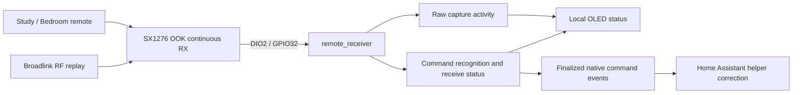

## Context

The [proposal](proposal.md) extends the verified, Home Assistant-adopted LilyGo LoRa32 T3 v1.6.1 with reception for the Study and Bedroom Mistral fan/light units. The authoritative handoff is [decisions.md](decisions.md); its Context block supplies the established hardware, ESPHome 2026.7.0, and Home Assistant facts used here.

The existing `esphome/lilygo-lora32-t3-v161.yaml` is a single self-contained configuration using `esp32dev`, the native ESP-IDF toolchain and framework, logging, secret-backed Wi-Fi and fallback recovery, an encrypted native API, and authenticated OTA. The extension adds OLED and receive-only radio support to that baseline. The archived baseline records successful physical deployment and retains a local, ignored pre-ESPHome full-flash backup.

Home Assistant sends commands through `remote.universal_remote` with Broadlink devices `rf.study_fan` and `rf.bedroom_fan`. Scripts write helpers optimistically; neither those helpers nor the template fan/light entities observe the appliances. The living-room fan uses `ir.living_room_fan` and is outside this change.

This design retains D48's accepted display/reception evidence and separate-event priority. D63's footer marks Broadlink's existing learned codes. D87 closes the button sweep with 15 accepted checks and 11 skipped by the user. D88–D90 select native per-room command events and source-aware helper correction, including calibrated brightness. D91 installs Phase 4; actual calibration and remaining live integration evidence are still pending. No acquisition, relearning, repeated Wi-Fi-outage tests or expected-command acknowledgement workflow is permitted. The complete existing [RF codebook](rf-codebook.md) remains the appliance protocol reference.

## Goals / Non-Goals

**Goals:**

- Receive the two Mistral remotes and their Broadlink replays on the existing board, using a frequency verified on the actual hardware.
- Recognize their fan and light commands from existing learned codes and develop receive status from actual OLED observations.
- Establish the on-board OLED before radio bring-up, then show raw capture activity and later recognized receive status independently of Home Assistant or Wi-Fi availability.
- Integrate received activity with the existing Home Assistant helpers once the Phase 4 decisions are resolved.
- Preserve the deployed connectivity, security, maintenance, and recovery baseline.

**Non-Goals:**

- RF transmission from the LilyGo or replacement of the Broadlink control path (D1).
- A general-purpose RF sniffer, other household devices, or the infrared living-room fan (D2).
- A second firmware configuration, an ESPHome package hierarchy, or support for the SD card, user LED, or battery ADC (D6, D11 and the baseline).
- Moving appliance state ownership to the node, replacing the template entities, or changing the Flutter application (D8 and the proposal).
- Claiming that an observed RF waveform proves the appliance received or executed a command (D14).

## Decisions

### Extend the same firmware and explicitly amend the base scope — D1, D6, D11, D16

Keep the existing device identity, single YAML, native ESP-IDF setup, five-key secret contract, encrypted API, and authenticated OTA. Add and verify the display in Phase 1, then add the receive path in Phase 2 to this configuration. The rationale is one physical board with one running firmware and a proven maintenance path. A parallel device YAML or dormant transmit implementation would introduce a second configuration or speculative behavior without serving reception.

The forthcoming specs artifact must contain both deltas:

| Capability | Delta |
| --- | --- |
| `lilygo-lora32-t3-v161-rf-receiver` | Add requirements for the receive capability and its phased outcomes. |
| `lilygo-lora32-t3-v161-base-firmware` | Modify the complete `Radio-neutral peripheral scope` requirement and its scenario to permit SX1276 reception and OLED support while continuing to exclude SD, user LED, battery ADC, and RF transmit. |

The existing prohibition cannot simply be ignored because the new work shares the base file. The published base spec remains authoritative until that modification is applied; this design does not itself amend it.

### Use native OOK continuous reception — D5

The selected receive path is ESPHome's native `sx127x` in OOK continuous mode, with bit synchronization disabled and packet mode off. Feed its demodulated DIO2 signal into `remote_receiver` on GPIO32. Input activity feeds the display directly. Recognition processes the same stream in memory using the existing 29-bit codebook; timing arrays are not recorded or dumped.

The established board connections are:

| Function | GPIOs | Use in this change |
| --- | --- | --- |
| SX1276 SPI | SCK 5, MISO 19, MOSI 27, CS 18 | Radio communication |
| SX1276 reset | RST 23 | Radio initialization |
| SX1276 data / interrupt lines | DIO0 26, DIO1 33, DIO2 32 | DIO2 feeds `remote_receiver`; the pin map is not a requirement to configure every line. |
| SSD1306 I2C | SDA 21, SCL 22 | Phase 1 display, used throughout receiver testing |
| SD card | CS 13, MOSI 15, MISO 2, SCK 14 | Outside scope |
| User LED / battery ADC | 25 / 35 | Outside scope |

Packet mode and `on_packet` were rejected because the target remotes use unframed PWM-encoded OOK bursts. ESPHome-to-ESPHome packet transport does not serve these remotes. An Arduino library or external decoder framework is unnecessary for the chosen native receive path. Per-burst RSSI from `on_packet` is unavailable on this path and cannot underpin transmitter discrimination.

**Working frequency (D38, superseding D4):** 433.92 MHz is established for this board by the user's confirmation that both physical remotes decode correctly on the OLED with D37's firmware. This supports the configured receive path; it does not claim a measured range or exhaustive command coverage. The 315 MHz fallback is no longer needed for this bring-up, and the negative frequency-metadata search need not be repeated.

D26 defines the initial radio settings: 433.92 MHz, 125 kHz bandwidth, 4800 bit/s configuration with bit synchronization disabled, -94 dBm receive floor, and automatic RX startup. GPIO32 input uses a 50 microsecond filter, 10,000-byte buffer, and 192 RMT/receive symbols. D36 replaces the initial 10 ms idle delimiter with 4 ms. Both physical remotes register under D38, and D40–D41 confirm separate Broadlink replays. D48 retires further offline/basic reception checks and directs work to event separation and marked packets. Retain the one-second OLED refresh; preserve events in history so rendering delay cannot overwrite a separate event.

### Establish the display before testing reception — D7, D16, D19, D22

First enable the SSD1306 with `ssd1306_i2c` on GPIO21/22 and verify visible startup/status output without needing the radio, command decoder, Wi-Fi, or Home Assistant. The initial screen must distinguish the receiver not yet being started from a running receiver with no captures.

For Phase 1, D19 makes that visual indication concrete: a heartbeat marker toggling once per second, uptime in seconds, Wi-Fi connected/disconnected status, native API client connected/disconnected status, and receiver-not-started status. The heartbeat and uptime advance from local runtime independently of network availability. After reboot, uptime starts over and the heartbeat resumes; connection labels follow the actual connection states as they recover or disconnect.

D22 selects the native `SSD1306 128x64` model at `0x3C`, without a reset pin, and a 10-pixel Roboto Mono font embedded at build time through ESPHome's font component. Five rows at y=0/12/24/36/48 show the title, uptime, Wi-Fi, API, and receiver status; an upper-right marker alternates hollow and filled once per second. The display reads the existing Wi-Fi/API components and 64-bit local uptime directly, without publishing diagnostic entities.

D32 replaces the interim raw-only screen with seven rows at y=-3/6/15/24/33/42/51: ROOM, BTN, RX, RAW, LAST, UP, and compact WIFI/API UP/DOWN states. The upper-right heartbeat remains. Existing font glyph metrics place visible text within the 128x64 panel. Radio or RMT failure takes precedence over RUNNING. Count and timestamp are volatile local diagnostics updated by `on_raw`; the screen refreshes once per second without forcing an I2C redraw for every edge. Raw timing dumps and capture-session logging are removed.

This separates a live display from a frozen startup frame and makes the OTA and offline checks observable on the board. The heartbeat does not represent received RF. The API label reports a connected native API client, not a uniquely identified Home Assistant client or independent proof of API encryption; the existing protocol checks still verify encrypted API recovery. These are local display diagnostics and do not select the later D12 publication surface.

Input count updates independently of recognition. ROOM and BTN start as NONE and show UNKNOWN for unmatched input until the first exact match. D36 preserves the last matched name across later fragments and shows BTN AGE; before a match, LAST shows input age. The RAW row also shows OK, a matched-frame count rather than a press count. RX shows MATCH, SHORT with input length, TIMING with decoded bit count, FRAMING, NO FRAME, or an unknown decoded CODE; radio/RMT errors take precedence. Existing stored data supplies the decoding evidence, so no RF recordings are required.

The activity count includes noise or unknown transmissions and does not count button presses. A changing counter alone does not prove a valid command. Phase 3 adds separate event identities and at least two recent OLED event records, each showing its actual room/button and source-marker evidence, so a second event before redraw does not erase the first.

This makes the OLED usable for the testing that D7 intended. Keeping it third would require logs for initial testing; bringing it up simultaneously with the radio would make display failures harder to separate from receiver silence. Both alternatives are superseded by the user's display-first direction in D16.

### Advance by hardware evidence, in four phases — D2, D3, D7, D15, D16, D20

| Phase | Approach and exit evidence | Detail left for phase entry |
| --- | --- | --- |
| 1. Local display | Enable the SSD1306 on GPIO21/22 and verify the live heartbeat, uptime/reset behavior, and Wi-Fi/API connection labels, including continued display updates without network access. | Begin with receiver-not-started status; decoded room/command fields depend on later evidence. |
| 2. Reliable receiver | Bring up the receiver and existing-code button decoder on the working display. Verify actual room/button labels for each physical remote first, then Broadlink replays. Establish working frequency and repeatable reception from OLED observations. | RF tuning remains a hardware question; stored codes already establish room IDs and command words. No acquisition sessions. |
| 3. Separate events and marked Broadlink bursts | Preserve separate decoded events, implement the footer encoder/decoder, update existing HA learned codes and verify new source/event behavior on the OLED. | Footer framing and integrity, per-room/button burst grouping, exact packet preservation and reversible code migration. |
| 4. Home Assistant integration | Publish separate received events and verify corrections through the existing helpers and template entities. | Marker-based attribution limits under D9, brightness reconciliation under D10, and publication contract under D12. |

This ordering follows the display-first correction and D29–D33's explicit exception for existing-code button recognition during receiver verification. Four phases remain within this change. OLED support remains in the receiver capability because its purpose is local receive diagnosis.

Within Phase 2, D20 separates verification by source: both physical remotes first, then Broadlink for both rooms. Under D29–D33, registration is checked through corresponding room/button names on the OLED. Record the source deliberately activated and the visible result; this does not claim the receiver inferred transmitter origin from an identical waveform. Home Assistant publication is not required.

The existing command inventory is the same for each room:

| Commands | Established meaning for later integration |
| --- | --- |
| `fan_off`, `speed_1` through `speed_5` | Absolute fan control, represented by the room's fan-state and speed helpers. |
| `fan_fr` | Direction button, recognized locally; no direction helper is introduced. |
| `light_off` | Light off. |
| `light_warm`, `light_neutral`, `light_cool` | Light on and the corresponding temperature selection. `light_cool` is the authoritative spelling under D13. |
| `light_brightness_up`, `light_brightness_down` | Relative steps only when calibrated and unmarked; BL/MIX echoes do not write brightness (D88–D90). |

The [codebook](rf-codebook.md) records all 26 existing command words, 101 complete reference frames, and provenance. D36 normalizes either input polarity, then decodes 29 alternating mark/space pairs into an 8-bit unit ID and 21-bit command; short/long is zero and long/short is one. Accept short timings of 150–600 microseconds and long timings of 800–1500 microseconds, require a terminal mark in either cluster and boundaries at the input edge or a normalized negative gap of at least 3 ms. Match both the exact unit ID and command payload. Partial frames, inconsistent levels and unknown words never create a match. Native tests exercise the actual YAML lambda using isolated references, complete stored transmissions, 4 ms input batches, both polarities, malformed input and consecutive callbacks before redraw. D54 defines event grouping and its limits; local frame counts do not count physical presses.

### Preserve separate events and identify marked bursts — D14, D15, D48–D63

The firmware retains eight volatile event records with independent local sequence numbers, room/button and marker evidence. D61 uses 12-pixel Roboto Mono with five properly spaced rows on two pages, alternating every five seconds. One page shows both latest events plus RAW/EV; D63's diagnostic page shows FOOTER YES/NO, latest source, sync YES/NO and bits NONE/FULL. Receiver/uptime and Wi-Fi/API occupy its final rows. The heartbeat and one-second refresh remain. Only aggregate parser results are retained; there is no waveform recording or RF log subscription. Repeat grouping is per room/button/candidate group. A recognized command opens a group and each recognized frame refreshes its last-command processing time. A valid footer closes it, allowing the next identical command to create a new event immediately. Unmarked commands start a new event after a different word in the same room or at least 300 ms since that key was processed. Different rooms do not suppress one another, and same-room button transitions survive between redraws. These policies do not guarantee physical press counts for identical unmarked signals.

The D63 format is `original command burst | 5A footer`; there is no RF header. The footer has a 20/20-tick sync, eight MSB-first bits (4/12 ticks for zero, 12/4 for one), and a 4-tick terminal mark: 172 ticks, approximately 5.238 ms. The native frame supplies room/button identity; there are no duplicate identity fields, version or checksum. D57 preserves the eight-byte B1 C0 transport header, except for its length at offsets 2–3. Waveform data starts at byte 8; offsets 4–7 are metadata and never RF timings. Native frames, repeat count and inter-frame spacing remain unchanged. Removal restores the exact original packet. Each valid footer closes a local candidate group; the fixed byte is not a changing per-send ID.

D63 removes D57's 332-tick prefix after the user confirms FOOTER YES but HEADER NO. The footer replaces part of the original final 1500-tick space with 160 quiet ticks, the 172-tick marker and 1168 remaining quiet ticks. Native tests assert unchanged command-start timing, total waveform duration and every native frame/repeat boundary, plus unchanged transport metadata and exact packet reversal. This zero nominal added delay uses the corrected byte-8 waveform boundary, not D53's rejected fictitious leading space. New physical attribution remains a canary gate.

Source label `BL` requires a valid footer following a recent candidate group containing one distinct recognized command word. Mixed-word groups preserve the individual events but label attribution `MIX`. The next callback after 300 ms without a recognized command abandons the group; a footer with no current candidate creates no event. Missing/damaged footers remain `?`, not proven human origin. An identical physical command interleaving inside a marked burst is indistinguishable. RMT queues timings without arrival timestamps, so callback spacing is processing time, not measured physical spacing.

The footer parser requires the full sync mark/space, all eight 5A bits, terminal mark, preceding callback edge or quiet boundary, and trailing quiet guard. Truncated markers are rejected. D63 retires A5 parsing and clipped-header recovery entirely.

For truly simultaneous RF, the single OOK demodulator may receive corrupt combined data. Preserve both events when their complete frames remain decodable; do not claim recovery of two lost frames or assign guessed names. Test corruption rejection separately from intact interleaving. No expected-command API, WAITING/HEARD timeout state machine or BUSY workflow is part of this design after D48.

D68 closes Phase 3 with the user's accepted interference limitation: overlapping remote presses interfered and the fan also failed to react. Exact OLED rows for that trial and physical remote/Broadlink separation were not reported. Further forced-overlap trials are retired as progression gates; these outcomes are not marked as successful collision recovery. D65 physically confirms footer-only BL attribution, D67 confirms separate identical-send records E004/E005, and D64 supplies native intact-interleaving coverage. Proceed to Phase 4 with those explicit limits.

D49 records the fresh immutable HA storage backup and its hash. Stage all 26 transformed packets, compare current storage to the backed-up input before writing, and leave unrelated RF/IR codes untouched. Deploy the compatible decoder first, update a single stored command as a canary, reload only the Broadlink integration to refresh its cached codes, and verify the new marker plus preserved appliance behavior. Then roll out the remaining codes. Keep exact original storage and the previous normal firmware image for rollback. This changes learned payloads without renaming commands or making the existing control scripts depend on the receiver.

### Retain helper-owned Home Assistant state — D8, D9, D10, D12, D13

The existing helpers remain the state owners:

| Helpers, for each of `study` and `bedroom` | Current representation |
| --- | --- |
| `input_boolean.<room>_fan_state`, `input_number.<room>_fan_speed` | Fan on/off and remembered speed 1–5 |
| `input_boolean.<room>_light_state` | Light state |
| `input_number.<room>_light_brightness` | Remembered brightness 1–7; off is the separate boolean |
| `input_select.<room>_light_temp` | `warm`, `neutral`, `cool`, exposed as 370/250/153 mireds |

The node contributes observations for a second writer in Home Assistant; it does not persist or own fan/light state. Moving that state to the node was rejected because it starts without knowing appliance state and cannot observe presses while offline. Keeping the helpers also avoids restructuring the template entities alongside the other active changes.

Absolute-command corrections converge with the existing script writes. D70 selects calibrated relative-brightness tracking; D87 closes the button sweep without requiring the skipped checks. D89 confirms live helper bounds 1–7. Establish physical anchors and effective step behavior separately in `button-verification.md` before enabling brightness corrections. The existing brightness script applies its own delta, so marked/mixed echoes are ignored. Calibration aligns the starting value; missed steps or missing source markers can still cause drift.

D88 resolves D12 with two native template event entities, Study RF Command (`study_rf_command`) and Bedroom RF Command (`bedroom_rf_command`). Each supports all 13 stored command names suffixed `_unmarked`, `_broadlink` or `_mixed`. The room comes from the entity and command/source stay together in one event type. Actual HA entity IDs are discovered after deployment before automation creation. Every retained event publishes once after its source is finalized: at the footer or after 300 ms without a recognized command, checked by a 50 ms tick. The eight-record buffer remains bounded; overwritten unpublished records increment an internal overflow counter. Offline events and disconnected pending publications are dropped rather than replayed at reconnect; native events have no initial-state replay. No command is emitted at boot.

D88/D89 use queued room-specific HA automations. Absolute fan/light commands set existing helpers idempotently for any finalized source; `fan_off` preserves the last speed and `light_off` preserves brightness/temperature. Each light temperature command sets light-on plus its named temperature. DIRECTION stays observable without a new state helper. Relative brightness applies only to unmarked events while the room's new calibration flag is on; marked and mixed brightness events cause no helper change. Live helper ranges are fan speed 1–5 and brightness 1–7. A separate calibration action records a user-confirmed current brightness level in the existing helper and enables its flag. It performs no RF sends and does not claim the physical level changed. Start uncalibrated; physical calibration and live correction still require acceptance. Existing template entities and transmitting scripts are retained.

D90 uses immutable `trigger.to_state` fields for queued command/source processing. The timestamp must be newer than the preceding state's `last_changed`, rejecting stale restoration without dropping a fresh first event after unknown/unavailable. Calibration flags deliberately reset off on HA restart and are cleared when the corresponding event entity becomes unavailable; existing state helpers are preserved.

D91's installed entities are `event.study_lilygo_lora32_t3_v1_6_1_study_rf_command` and `event.study_lilygo_lora32_t3_v1_6_1_bedroom_rf_command`. The additions are `automation.lilygo_{study,bedroom}_rf_helper_correction`, `input_boolean.lilygo_{study,bedroom}_brightness_calibrated`, and `script.lilygo_{study,bedroom}_calibrate_brightness`. Rollback disables the two correction automations, clears the two flags and restores the retained D64 OTA image if necessary; existing Broadlink scripts and stored footer values do not depend on these additions.

D100 verifies the final virtual-appliance path: both MQTT wall-button automations and the app control `fan.<room>_fan` / `light.<room>_light`; those template entities read the same helpers corrected by the LilyGo automations. Home Assistant dashboard cards and Flutter controls read the template entities. The Zigbee relay entities indicate their power circuits, not the fan/light state, and received RF never actuates them. A normal-use Study SPEED 4 event set speed helper 4 and its virtual fan reported on/80%; Bedroom SPEED 1 likewise reported on/20%. No second synchronization path or HA configuration edit is needed for these controls. `fan_fr` remains a momentary event because a persistent direction cannot be inferred without a physical anchor and the current template fan exposes no direction state.

## Risks / Trade-offs

- **Wrong frequency or unsuitable RF hardware** → Settle D4 on the physical unit before interpreting silence as a software fault. Successful validation and compilation do not establish reception.
- **Room attribution is incorrect** → Stored unit IDs are distinct (Study `0x21`, Bedroom `0xCB`). Match the full unit and command word, then verify the labels on the OLED.
- **Observation is mistaken for execution or origin proof** → Keep the D14 evidence boundary explicit. Only valid associated footers provide marker evidence; unmarked is not proven human origin.
- **Raw activity is mistaken for a valid command** → Require a complete codebook match before displaying a room/button; verify actual names on the OLED without recording sessions.
- **Repeated frames are counted as separate commands, or separate brightness steps are collapsed** → Use existing repeat evidence and physical observations to settle D15 before relying on logical command counts. The raw diagnostic count does not count presses.
- **Brightness is double-counted or drifts after a missed burst** → Resolve D9 and D10 before implementing Phase 4 brightness writes. No correctness claim follows from hearing relative commands alone.
- **Existing Home Assistant state is already stale** → Preserve D8's distinction between helper ownership and physical truth. In particular, `script.rf_light_temp` can update its helper while the light is off without transmitting, and the receiver cannot reconstruct unobserved history.
- **Overlapping sends complicate matching** → Include the recorded script concurrency in Phase 3/4 decisions: `script.rf_light_temp` is parallel (max 10), while the other target scripts are queued. Do not infer a single global command order.
- **Later phases are mistaken for fully specified implementation** → Keep their entry questions visible in tasks and append decisions when hardware evidence resolves them (D3, D15). Artifact completion is not hardware acceptance or resolution of the Proposed entries.
- **Live integration has no committed automation files** → Verify Phase 4 against observed Home Assistant behavior and record that evidence; repository diffs alone cannot establish acceptance (D11).

## Migration Plan

1. Create the new receiver spec and the full base-scope delta identified above. Keep unresolved choices visible in their acceptance boundaries and the later tasks artifact; do not turn a Proposed entry into a settled requirement by implication.
2. Retain D25's accepted display and D38–D41's accepted basic reception results; do not rerun outage or already-confirmed recognition checks.
3. Implement native packet transformation, footer decoding and separate event history. Test intact interleaving and corrupted input at the actual callback boundary. Deploy the receiver, migrate the backed-up learned codes through a canary and targeted reload, and verify new footer/concurrency behavior on the OLED.
4. Resolve D9's demonstrated attribution policy and D10/D12 before integrating event publication with helper corrections. Verify that new behavior through the existing helpers and entities; Broadlink remains the transmitter.
5. If firmware recovery is needed, return to the proven base configuration through the authenticated OTA or USB route. Retain the archived baseline's ignored full-flash backup as the pre-ESPHome restore path; do not replace it with a new RF-build backup or commit it. If Phase 4 corrections need rollback, remove or disable those additions so the existing Broadlink scripts and helper model remain usable.

The rollback approach preserves the established baseline and D1/D8 boundaries. No deployment or Home Assistant mutation is performed by creating this artifact.

## Remaining acceptance

| Decision / dependency | Still unresolved | Resolve when |
| --- | --- | --- |
| D10 — Contract selected by D88–D90 | Physical anchors, effective step behavior and live brightness reconciliation | Separate calibration, without repeating the closed button sweep. |
| Phase 4 live acceptance | Unobserved speed/light correction paths and calibrated brightness echoes | Normal-use observations or explicit user acceptance; keep unobserved cases distinct. |

D15/source grouping and D12/publication are resolved and installed. Remaining acceptance depends on actual observations, not renewed lookup of established facts.
